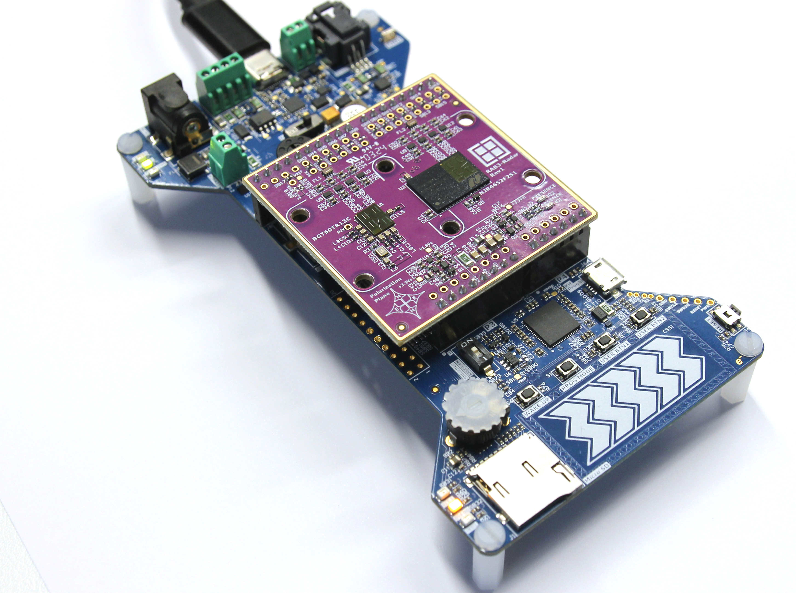
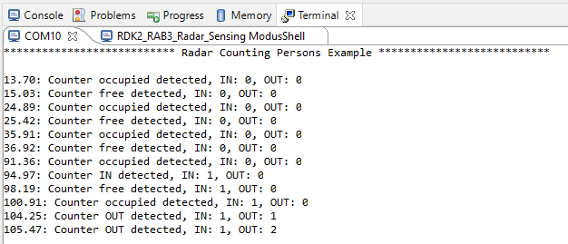

# RDK2 RAB3 Radar Sensing

This code example is a BGT60TR13C Radar *Presence Detection* and *Counting Persons* algorithms demonstration. The ModusToolbox project is based on the Infineon [xensiv-radar-sensing](https://github.com/Infineon/xensiv-radar-sensing) library and its documentation. 

 

## Requirements

- [ModusToolbox® software](https://www.infineon.com/cms/en/design-support/tools/sdk/modustoolbox-software/) **v3.x** [built with **v3.1**]
- [RAB3-Radar Rev1](https://github.com/RutronikSystemSolutions/RAB3_Radar_Hardware_Files) [first release]

## Supported toolchains (make variable 'TOOLCHAIN')

- GNU Arm&reg; Embedded Compiler v11.3.1 (`GCC_ARM`) - Default value of `TOOLCHAIN`

## Using the code example

Create the project and open it using one of the following:

<details><summary><b>In Eclipse IDE for ModusToolbox&trade; software</b></summary>


1. Click the **New Application** link in the **Quick Panel** (or, use **File** > **New** > **ModusToolbox&trade; Application**). This launches the [Project Creator](https://www.infineon.com/ModusToolboxProjectCreator) tool.

2. Pick a kit supported by the code example from the list shown in the **Project Creator - Choose Board Support Package (BSP)** dialogue.

   When you select a supported kit, the example is reconfigured automatically to work with the kit. To work with a different supported kit later, use the [Library Manager](https://www.infineon.com/ModusToolboxLibraryManager) to choose the BSP for the supported kit. You can use the Library Manager to select or update the BSP and firmware libraries used in this application. To access the Library Manager, click the link from the **Quick Panel**.

   You can also just start the application creation process again and select a different kit.

   If you want to use the application for a kit not listed here, you may need to update the source files. If the kit does not have the required resources, the application may not work.

3. In the **Project Creator - Select Application** dialogue, choose the example by enabling the checkbox.

4. (Optional) Change the suggested **New Application Name**.

5. The **Application(s) Root Path** defaults to the Eclipse workspace which is usually the desired location for the application. If you want to store the application in a different location, you can change the *Application(s) Root Path* value. Applications that share libraries should be in the same root path.

6. Click **Create** to complete the application creation process.

For more details, see the [Eclipse IDE for ModusToolbox&trade; software user guide](https://www.infineon.com/MTBEclipseIDEUserGuide) (locally available at *{ModusToolbox&trade; software install directory}/docs_{version}/mt_ide_user_guide.pdf*).

</details>

### Operation

The firmware example uses KitProg3 Debug UART for debug output. LED1 and LED2 are used to indicate the presence or absence of states in Presence Detection mode.


The Counting Persons mode is enabled by uncommenting the definition as shown below

```C
/*******************************************************************************
 * Macros
 ********************************************************************************/
//#define PRESENCE_DETECTION
#define COUNTING_PERSONS
```



### Debugging

If you successfully have imported the example, the debug configurations are already prepared to use with the KitProg3 or MiniProg4. Open the ModusToolbox perspective and find the Quick Panel. Click on the desired debug launch configuration and wait for the programming to complete and the debugging process to start.


## Legal Disclaimer

The evaluation board including the software is for testing purposes only and, because it has limited functions and limited resilience, is not suitable for permanent use under real conditions. If the evaluation board is nevertheless used under real conditions, this is done at one’s responsibility; any liability of Rutronik is insofar excluded. 


